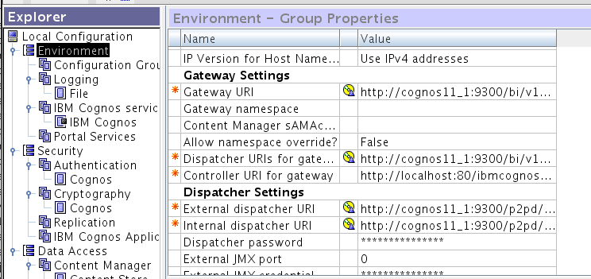

# DB2 image
* Get DB2-C image, register from https://hub.docker.com/_/db2-developer-c-edition
  * Then `docker pull store/ibmcorp/db2_developer_c:11.1.4.4-x86_64`
  * The persistent storage of the image will require to create a named volume, which is handled in the `docker-compose.yaml` file
    * This image is built on **CentOS-7**
    * Setup with userid `db2inst1` (pw:passw0rd)
  * To start the container stand-alone, execute `docker-compose up -d db2-dev-c`
    * You can tail the container with `docker-compose logs -f`
  * Once started, you can check which databases exist with `docker exec -ti db2server bash -c "su - db2inst1 -c 'db2 list db directory'"`
  * Extract the db2jcc JDBC drivers from the image and place them in the `cognosca\media` directory
  ```
  docker cp db2server:/opt/ibm/db2/V11.1/java/db2jcc4.jar cognosca\media
  docker cp db2server:/opt/ibm/db2/V11.1/java/db2jcc.jar cognosca\media
  docker cp db2server:/opt/ibm/db2/V11.1/java/db2jcc_license_cu.jar cognosca\media
  ```
  * Stop the stand-alone db2-dev-c server using `docker-compose down`

# Cognos image
The build is derived from gnome/centos 6 docker from https://github.com/nutsllc/vnc-centos-gnome

The VNC server will expose two ports, `5900` as `root` (pw:centos) and `5901` as user `toybox` (pw:password)
xRDP port is `3389`

* Get Cognos packages from Passport advantage (see packaeg IDs in the Dockerfile), and place them into the `cognosca\media` directory.
* Ensure that `cognosca\media` has the 3 `db2jcc*` files

# Start the two containers using docker-compose and the provided docker-compose.
* The image will be built using docker-compose, by executing `docker-compose up --build -d`

* Tail the logs: `docker-compose logs -f`

* Run detached without rebuilding: `docker-compose up -d`

# Post-config:
* Check that the 3 `db2jcc*.jar` DB2 drivers files are present in `/opt/ibm/cognos/analytics/drivers`
* Get into the image desktop using VNC
* Start the interactive configuration tool: `/opt/ibm/cognos/analytics/bin64/cogconfig.sh`
  * Fix the hostnames, replace the hostnames in environment URI entries with `cognos11_1` 
  * Setup the content manager: 
  * From the *Content Store* menu, run *Generate DDL*. You get a file in `/opt/ibm/cognos/analytics/configuration/schemas/content/db2/createDb.sql`
    * Extract the file and send it to the DB2 Machine:
    ``` 
    docker cp cognos11_1:/opt/ibm/cognos/analytics/configuration/schemas/content/db2/createDb.sql .
    docker cp createDb.sql db2server:/var/db2_setup/createDb.sql
    ``` 
  * Create the CM database:
    * `docker exec -ti db2server bash -c "su - db2inst1 -c \"db2 -tf /var/db2_setup/createDb.sql -v\""`
  * Start the config using `Actions/Start` menu

  * To extract the Cognos config file from the container, use: `docker cp cognos11_1:/opt/ibm/cognos/analytics/configuration/cogstartup.xml .`